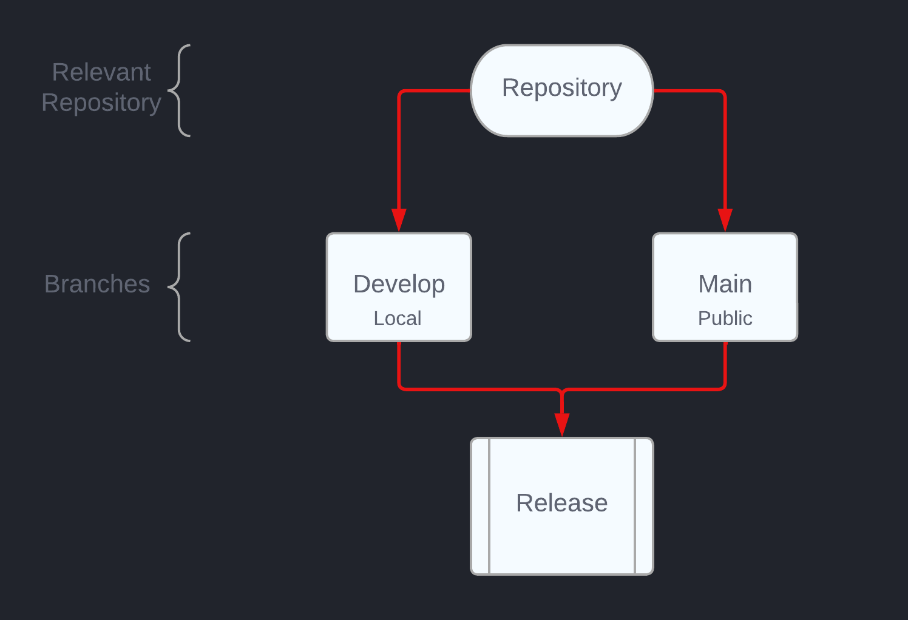

## CMPG-323-Overview---34510982

### Repositories created & used
---
Each project will have its own repository, as specified in the brief.
# - Project 1:    CMPG323-Overview---34510982
- Project 2:    CMPG323-Project-2---34510982
- Project 3:    CMPG323-Project-3---34510982
- Project 4:    CMPG323-Project-4---34510982
- Project 5:    CMPG323-Project-5---34510982
- PoE: CMPG323-PoE---34510982

### Integration diagram
---

### Branching strategy
---
GitHub Flow is a quick and simplified branching strategy with shorter development cycles and regular releases since it is based on Agile concepts. If this is the case, the transient branch will be linked to and merged with the main branch appropriate to the individual project.

### Use of .gitignore
---
A .gitignore file is a text file in your git repository that instructs git not to track specific files and directories that you do not want to be added to your main repository. This file will be updated as needed to hide sensitive information and data used for testing.