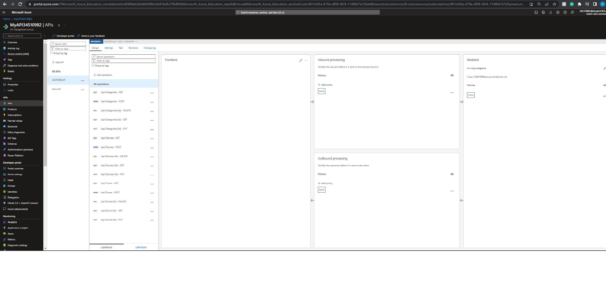
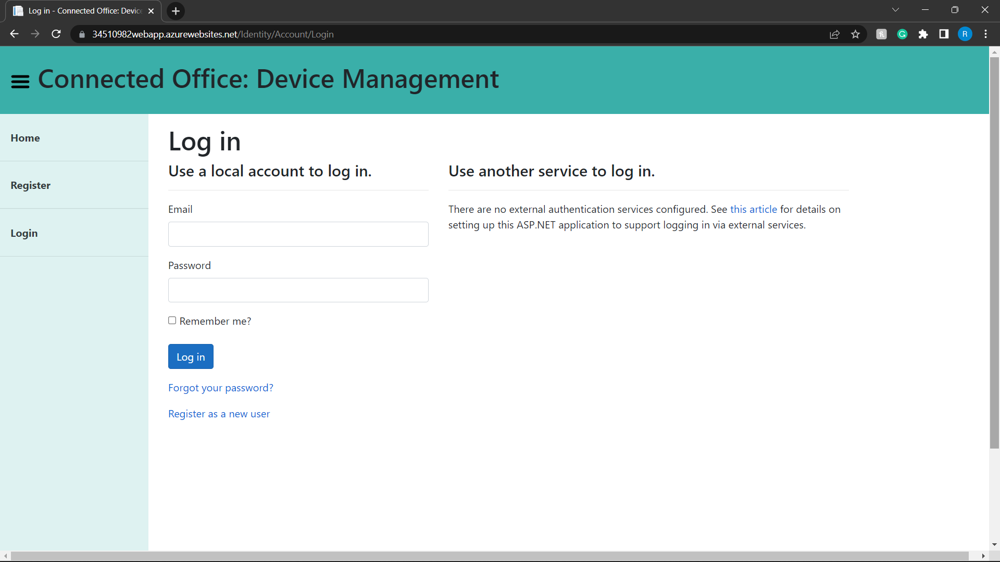
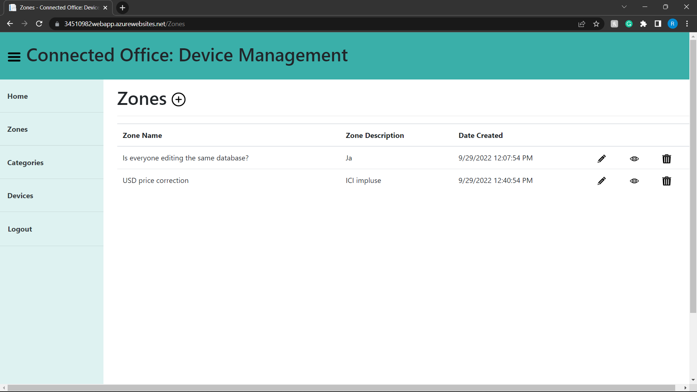
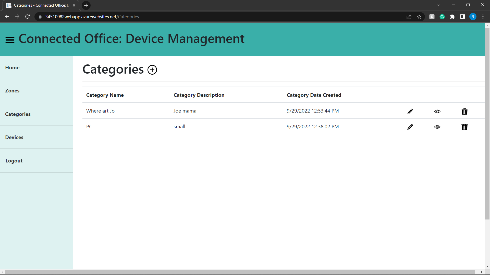
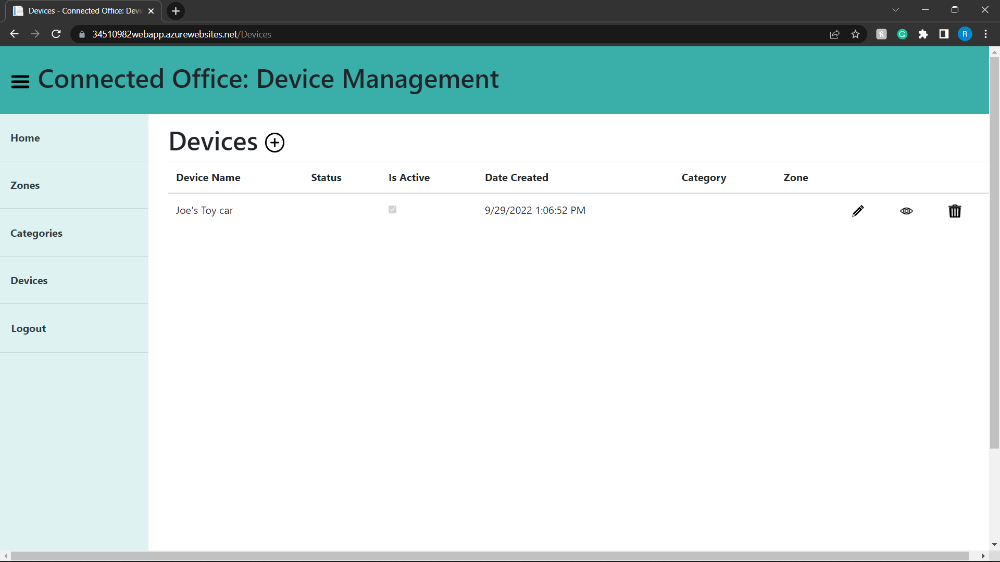

## CMPG-323-Overview---34510982

### Integration diagram
---

### Branching strategy
---
GitHub Flow is a quick and simplified branching strategy with shorter development cycles and regular releases since it is based on Agile concepts. If this is the case, the transient branch will be linked to and merged with the main branch appropriate to the individual project.

Through the semester, this branching strategy proved to be a very useful tool and without a doubt saved me a couple of times. I mainly worked in the local repository (develop branch) and thereafter committed the changes to the remote repository (main branch) once I was happy with all changes and no problems were detected during testing.

Since I was the only one committing to the main branch, I had no troubles with merging changes or lost updates. I learned a lot from implementing this strategy and will without a doubt keep on using it on my personal projects.

### Use of .gitignore
---
A .gitignore file is a text file in your git repository that instructs git not to track specific files and directories that you do not want to be added to your main repository. This file will be updated as needed to hide sensitive information and data used for testing.

I made use of a .gitignore file in some of my projects to not commit files to my remote repository where sensitive information is stored such as login or user credentials.

---
---

## CMPG323-Project-2---34510982

### Repository link
---
https://github.com/Rohan-Hefer/CMPG323-Project-2---34510982

### Summary
---
This was my first time working with Azure, It took some getting used to and was quite a big learning curve for me. This project overwhelmed me at first as I did not completely understand what the outcome should be. Nevertheless I felt like I have completed it successfully and I was satisfied with the outcome.

### gitignore file
---
Added the appsettings.json file to .gitignore to hide the credentials in my connection string.

### API Endpoints
---

---
---

## CMPG323-Project-3---34510982

### Repository link
---
https://github.com/Rohan-Hefer/CMPG323-Project-3---34510982

### Summary
---
This was by far my most difficult project. I struggled to fix every problem with my little coding abilities. I encountered numerous faults that I had to fix in order to complete the job, only to find that there were still more issues. It was a pleasant challenge and, it must be mentioned, the most satisfying project this semester. After completing this project, my time management skills significantly improved.

### Link
https://34510982webapp.azurewebsites.net/

### Branching
---
A develop branch was used on early stages of development. It was however easier to only use the main branch since I only commited if the code had no errors. I was also the only one using the repo.

### gitignore file
---
Added the appsettings.json file to .gitignore to hide the credentials in my connection string.

### Screenshots
---
# Login

---
# Zones

---
# Categories

---
# Devices

---
---

## CMPG323-Project-4---34510982

### Repository link
---
https://github.com/Rohan-Hefer/CMPG323-Project-4---34510982

### Summary
---
Through this assignment, I learned about a new tool that I would most definitely utilize in the future. Once you get it, the possibilities are endless. It took some getting used to. Although there were some problems, the UiPath community was incredibly supportive and the issues were quickly remedied.

### YouTube Link
---
https://youtu.be/TPTJUPoReoI

### Branching
---
Only made use of the master branch as I was the only one commiting to the repository. Version control was implemented by commiting only when a certain milstone have been reached and tested.

---
---

## CMPG323-Project-5---34510982

### Repository link
---
https://github.com/Rohan-Hefer/CMPG323-Project-5---34510982

### Summary
---
Yet another helpful tool. It took some getting used to this project. Although it took some time to come together, it was a good way to bring all of the efforts this semester together.

### Branching
---
Only made use of the master branch as I was the only one commiting to the repository. Version control was implemented by commiting only when a certain milstone have been reached and tested.

### Report URL
---
https://app.powerbi.com/groups/me/reports/bbcad7ec-4290-4304-a212-d716343be4a1/ReportSection